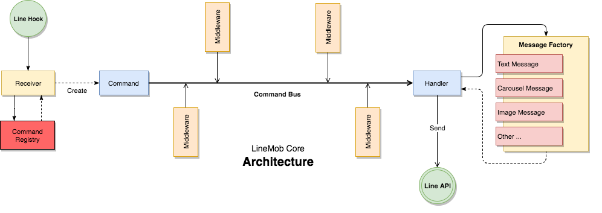
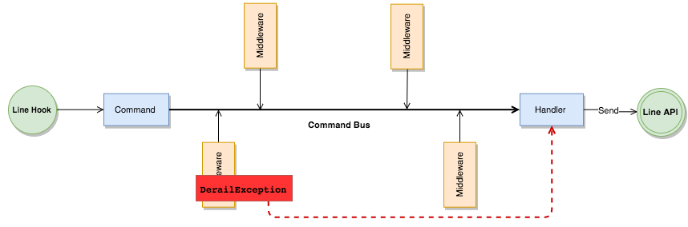
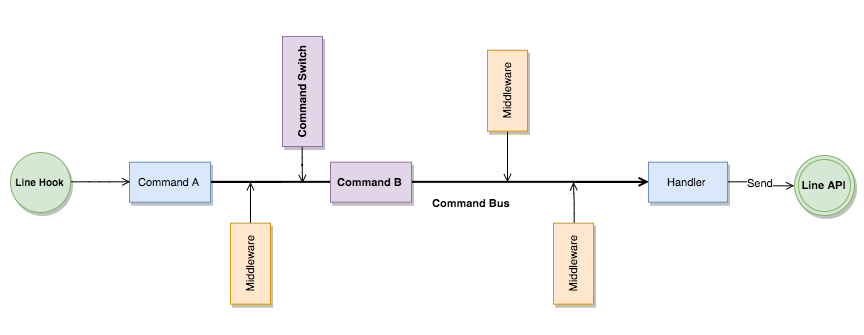

## Architecture
LineMob Core ถูกออกแบบโดยใช้ Command/Query Pattern แต่จะว่าไปแล้ว LineMob Core จะเป็นเพียงส่วน `Command` เท่านั้น



## Basic
หลักการพื้นฐานของ LineMob Core ค่อนข้างง่ายมากๆ ทำให้การเขียน Bot เป็นเรื่องไม่ยากเย็นอะไรเลย เราเพียงแต่ต้องทำความเข้าใจสิ่งต่างๆ เพียงเล็กน้อย ดังนี้

### Command
`Command` คือ ​Object ที่เก็บข้อมูล (Information) ต่างๆ โดยพื้นฐานแล้ว `Command` คือข้อมูลที่ประกอบใน `คำสั่ง` ที่ใช้บอกให้ `handler` ว่าต้องการให้ทำงานอะไร
ในที่นี้เราจะใช้ Command เพื่อวัตถุประสงค์ 3 อย่างคือ
  1. ใช้เก็บสถานะ (State) ระหว่างการประมวลผลในระดับ Business Logic คือในระหว่างที่ Command ถูกส่งไปยัง Handler เราจะเก็บสถานะอะไรไว้ระหว่างนั้นก็ได้ สิ่งนี้เราจะเห็นภาพชัดเจนในหัวข้อของ `Middleware`
  2. ใช้เก็บคำสั่ง (Message) ที่ Handler ต้องการ ในที่นี้คือ message ที่ต้องส่งไปยัง Line API เป็นข้อมูลตามมาตรฐานของ ​Line API และ LineMob Core ได้สร้างชุด Class Message Templates ง่ายๆ สำหรับการสร้าง message ดังกล่าว
  3. ใช้เก็บ `input` หรือ Request information ที่ถูกส่งมาจาก Line APP.

Command ถูกสร้างขึ้นโดยคุณ และถูกเรียกใช้โดย LineMob Core มีสิ่งที่คุณเข้าใจอีกเล็กน้อยเกี่ยวกับ Command คือ มันทำงานใกล้เคียงกับ `Client/Server` ดังนั้น เมื่อ Command ถูกสร้างขึ้นโดย ​LineMob Core มันจะทำการเก็บข้อมูลที่ได้รับจาก Line APP ไว้ใน Property `input` เปรียบเสมือนเป็น `request` ใน Client/Server


ตัวอย่างการสร้าง Command

```php
<?php

use LineMob\Core\Command\AbstractCommand;

class YourCommand extends AbstractCommand
{
    
}

```

ง่ายแค่นี้เอง นี่เป็น Command แบบย่อที่สุด ซึ่งหลายกรณีการสร้าง Command ด้วยขั้นตอนเพียงเท่านี้ก็ถือว่าเพียงพอ
แต่ถ้าหากคุณต้องการกำหนดคำสั่งพิเศษให้กับ Command นั้นๆ เช่น หากคุณต้องการให้ Command ของคุณรับคำสั่ง แบบเฉพาะเจาะจงที่ผู้ใช้ส่งมาจาก Line App เราเพียงแต่กำหนดดังนี้

```php
<?php

use LineMob\Core\Command\AbstractCommand;

class YourCommand extends AbstractCommand
{
    protected $cmd = ':mycommand';
}

```

เพียงเท่านี้ Command ของคุณจะถูกเรียกใช้งานเมื่อผู้ใช้ Line App พิมพ์ข้อความ `:mycommand` เข้ามา

ง่ายมากใช่ไหมครับ!

### Bus
`Bus` คือ Object Service ที่ทำหน้าที่ส่ง Command ไปยัง Handler คุณไม่ต้องทำอะไร ส่วนนี้ LineMob Core เป็นคนทำหน้าที่นี้


### Middleware
`Middleware` คือ กลุ่มของ Object Service ที่ใช้เปลี่ยนแปลง State ของ Command (Side Effect Manage) ส่วนนี้ถือเป็นหัวใจหลักของ LineMob Core โดยส่วนมากคุณจะต้องทำการโปรแกรม (Bussiness Logic) ใน middleware
 และคุณควรออกแบบ Middleware ให้เป็น Service ที่สามารถ Reuse ได้ **ข้อควรจำที่สำคัญที่สุดของ middleware คือมันจะทำงานเป็นลำดับ (Sequence) ตามที่เรา Register เข้าไปในระบบ**

อย่างที่คุณได้รู้ไปแล้ว Middleware ถูกออกแบบให้เป็น Service สำหรับการเปลี่ยนค่าของ Command (Mutation) ดังนั้นคุณจึงสามารถออกแบบ middlware ให้ติดต่อกับระบบภายนอก เช่น ติดต่อกับฐานข้อมูล เชื่อมต่อกับ api ต่างๆ อะไรก็ได้ ตามแต่ความต้องการของคุณ
 
วิธีการสร้าง Middleware นั้นแสนง่าย

```php
<?php

use League\Tactician\Middleware;
use LineMob\Core\Command\AbstractCommand;

class CleanInputTextMiddleware implements Middleware
{
    /**
     * @param AbstractCommand $command
     *
     * {@inheritdoc}
     */
    public function execute($command, callable $next)
    {
        $command->input->text = trim(preg_replace(['/ +/'], [' '], $command->input->text));

        return $next($command);
    }
}

```

`CleanInputTextMiddleware` เป็นตัวอย่างการเขียน middle เพื่อ cleanup `input-text` ที่รับมาจากผู้ใช้งาน โดยจะทำการตัดช่องว่าง (Space) ที่ไม่จำเป็นออกไป


```php
<?php

use League\Tactician\Middleware;
use LineMob\Core\Command\AbstractCommand;
use LineMob\Core\Template\TextTemplate;

class TextMessageMiddleware implements Middleware
{
    /**
     * @param AbstractCommand $command
     *
     * {@inheritdoc}
     */
    public function execute($command, callable $next)
    {
        $command->message = new TextTemplate();
        $command->message->text = "Hello, Line User";

        return $next($command);
    }
}

```

`TextMessageMiddleware` เป็นตัวอย่างการสร้าง message สำหรับส่งกลับไปยังผู้ใช้

และหากคุณต้องการกำหนดให้ middleware ของคุณทำงานเฉพาะเจาะจงกับ Command ใดๆ ก็เพียงแต่กำหนดดังนี้

```php
<?php

use League\Tactician\Middleware;
use LineMob\Core\Command\AbstractCommand;
use LineMob\Core\Template\TextTemplate;

class TextMessageMiddleware implements Middleware
{
    /**
     * @param AbstractCommand $command
     *
     * {@inheritdoc}
     */
    public function execute($command, callable $next)
    {
        if (!$command instanceof \YourCommand) {
            return $next($command);
        }
                
        $command->message = new TextTemplate();
        $command->message->text = "Hello, Line User";

        return $next($command);
    }
}

```

ข้อความจำเล็กน้อยของ middleware คือ คุณต้องคืนค่า `return $next($command);` เพื่อให้ระบบ `Bus` วิ่งไปยัง middleware ถัดไป


### Handler
`Handler` คือ ​Object Service ที่ทำหน้าที่ส่งข้อมูลไปยัง Line API Server ส่วนนี้คุณไม่ต้องโปรแกรมอะไร เป็นหน้าที่ของ LineMob Core

### Setup
การ Setup `Command/Middleware` ดูตัวอย่างใน `\LineMob\Core\QuickStart::setup` ส่วนตัวอย่างการ setup แบบง่ายคือ ดังนี้

```php
<?php

// Your controller
public function yourAction(Request $request)
{
    $config = [
        'line_channel_token' => 'Your own line bot channel token',
        'line_channel_secret' => 'Your own line bot channel secret',
    ];

    $quickStart = new \LineMob\Core\QuickStart([
        new \CleanInputTextMiddleware(),
        new \TextMessageMiddleware(),
    ]);
    
    $receiver = $quickStart
        ->addCommand(\YourCommand::class, true)
        ->setup($config['line_channel_token'], $config['line_channel_secret'], ['verify' => false])
    ;
    
    $signature = $request->getHeaderLine('X-Line-Signature');
    $data = $request->request->all();
    
    if ($receiver->validate($data, $signature)) {
        $receiver->handle($data);
        
        return Response('OK', 200);
    } else {
        return Response("Invalid signature: ".$signature, 500);
    }
}

```

## Advance
หัวข้อนี้ สำหรับการใช้งาน LineMob Core ขั้นสูง ซึ่งจะพูดถึงการทำให้ `Command` ของคุณเก็บสถานะไว้ได้ (Stateful)

### DerailException


หากเราต้องการออกจาก `Bus` และข้ามไปยัง `Handler` ทันที หรือไม่ต้องการให้ `Middleware` อื่นๆ ทำงานต่อ
เราสามาร ใช้ `DerailException` เพื่อส่ง Command ไปยัง Handler ทันที

```php
<?php

use League\Tactician\Middleware;
use LineMob\Core\Command\AbstractCommand;
use LineMob\Core\Exception\DerailException;

class TextMessageMiddleware implements Middleware
{
    /**
     * @param AbstractCommand $command
     *
     * {@inheritdoc}
     */
    public function execute($command, callable $next)
    {
        if (!$command instanceof \YourCommand) {
            return $next($command);
        }

        // Derail me to handler now!
        throw new DerailException($command);
    }
}

```


### Stateful command
TODO

### Command Storage
TODO

### Command Switch Middleware
บางกรณีเราอาจจะอยากเปลี่ยน Command ในระหว่างการประมวลผล `\LineMob\Core\Middleware\CommandSwitcherMiddleware` ช่วยเราได้



วิธีการใช้งานก็เหมือนกับการใช้ `Middleware` อื่นๆ ดูที่หัวข้อ [Setup](#setup) และมีสิ่งที่เราต้องทำเพียงเล็กน้อย คือสร้าง middleware สำหรับกำหนด command ที่เราต้องการเปลี่ยน ดังนี้

```php
<?php

use League\Tactician\Middleware;
use LineMob\Core\Command\AbstractCommand;
use LineMob\Core\Template\TextTemplate;

class SwitchingMiddleware implements Middleware
{
    /**
     * @param AbstractCommand $command
     *
     * {@inheritdoc}
     */
    public function execute($command, callable $next)
    {
        $cmd = new \YourSwitchedCommand();
        $cmd->message = new TextTemplate();
        $cmd->message->text = "Hi, I'm SwitchedCommand";

        // copy input
        $cmd->input = $command->input;

        // MUST be `switchTo` key
        $command['switchTo'] = $cmd;

        return $next($command);
    }
}

```

### Workflow Middleware
TODO

### Doctrine Transactional Middleware
TODO
